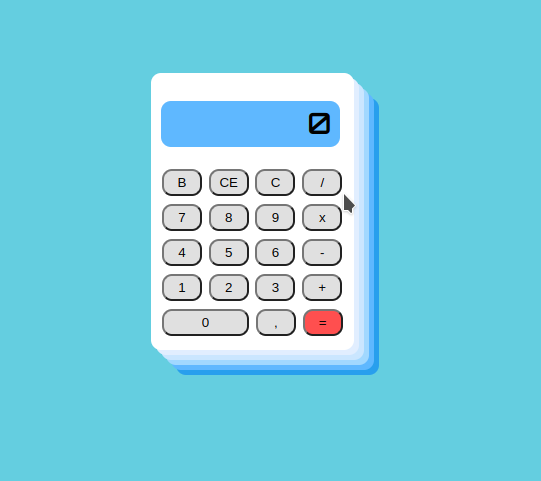

# ProjetosBasicos
O repositório apresentará alguns projetos básicos, com o principal foco em projetos iniciais sobre alguma linguagem específica da qual eu estiver aprendendo no momento.

## Calculadora
A Calculadora é bem simples para realizar a sua execução, sendo necessário apenas abrir o arquivo "index.html" pelo seu browser. O uso da ferramenta Live Server pode auxiliar caso queira realizar mudanças no código.

